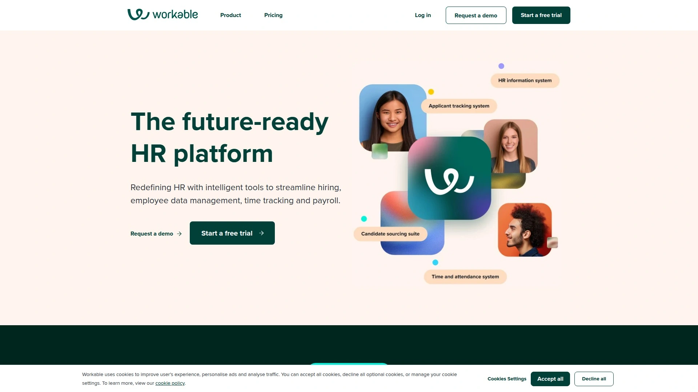
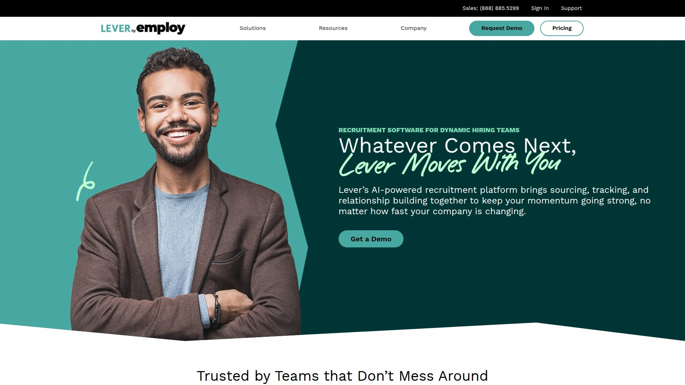
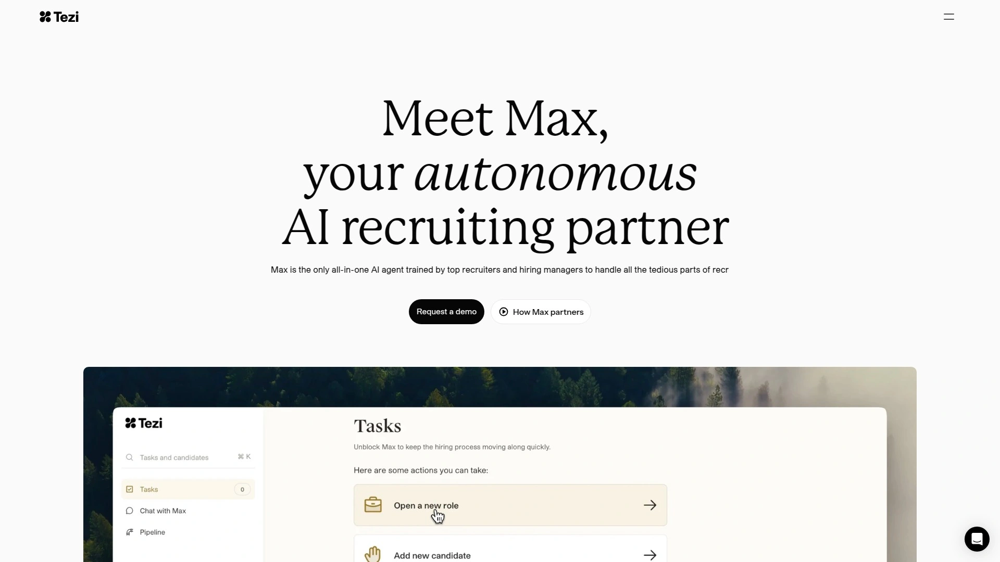

# 再也不用手动筛简历了!推荐15款自动化招聘的神器!

招聘这活儿,说实话挺折磨人的。每天收到几百份简历,一个个看过去眼睛都花了,还得约面试、写候选人报告、更新招聘系统,光这些杂活就能占掉大半天时间。真正用来跟候选人聊天、判断人靠不靠谱的时间反而不多。AI招聘工具就是专门解决这个痛点的,让机器干重复性的活,把人解放出来做更有价值的事。这些工具能自动筛选简历、给候选人排序、安排面试时间,有的还能直接跟候选人聊天做初步筛选,效率能提升好几倍。下面这15款工具都是2025年市场上比较能打的,功能各有侧重,总有一款适合你的招聘场景。

## **[Carv](https://www.carv.com)**

会议中自动记录,会后文档就绪。

Carv最大的特点是能加入你的各种会议,不管是视频通话、电话还是线下面对面,它都能实时记录对话内容并自动完成后续任务。当你跟候选人聊完天,系统已经帮你生成好了候选人档案、面试总结、岗位描述,连招聘系统都同步更新完毕,整个过程不需要你动手。这种工作方式让招聘官可以在面试时专心观察候选人,而不是埋头记笔记。平台包含三大模块,面试AI负责会议记录和文档生成,对话AI处理大批量候选人咨询和初筛,人才库AI自动匹配现有候选人到新岗位。可以定制化训练AI按照你的风格输出内容,甚至连语气和格式都能调。通过了ISO和SOC 2 Type II认证,数据安全有保障。客户反馈显示能减少80%的行政任务量,招聘成本降低70%,速度提升3倍。月付起价60欧元,适合各种规模的招聘团队使用。

## **[Paradox (Olivia)](https://www.paradox.ai)**

24小时在线的AI招聘助手,候选人半夜咨询也有人回。

Olivia是Paradox开发的对话式AI助手,通过短信、网页聊天、WhatsApp等渠道跟候选人互动,能回答问题、筛选资格、安排面试,全程不需要人工介入。特别适合零售、餐饮、物流这些需要大量招聘一线员工的行业。有个春季招聘案例很夸张,用了Olivia之后申请完成率从50%飙到85%,入职时间从12天压缩到4天。候选人体验也很好,就像发微信聊天一样自然,不用填复杂的表格。系统全天候运行,候选人晚上11点咨询照样能得到回复并完成筛选和预约。能跟现有的招聘系统和CRM整合。招聘官反馈说那些"这岗位还招人吗"之类的重复问题再也不用回答几百遍了,省下的时间能多面试几个人。价格需要联系官方定制,大公司用得比较多。

## **[HireVue](https://www.hirevue.com)**

视频面试加AI评估,大规模招聘不慌张。

HireVue是专门做视频面试和AI评估的企业级平台,适合同时招几百上千人的场景。候选人可以录制视频回答问题,也可以参加实时视频面试,AI会分析回答内容评估能力和预测工作表现。提供标准化的面试指导,确保每个候选人都被问到相同问题,减少主观偏见。系统会生成能力评估报告,帮招聘官快速找出最合适的人选。特别适合零售、医疗、客服等需要批量招聘的行业。有客户用了之后把招聘周期缩短了60%,因为好候选人能被立刻识别出来不用排队等人看。界面设计得比较专业,新手可能需要一点时间适应。价格没有公开,需要根据企业规模和使用量定制。

## **[Eightfold AI](https://eightfold.ai)**

人才智能平台,不只是招聘还管内部调动。

Eightfold最厉害的地方是它不仅帮你找外部人才,还能挖掘公司内部员工的潜力。系统会分析员工技能和职业发展路径,当有新岗位时自动推荐合适的内部候选人,这对留住人才很有帮助。AI会主动给出招聘建议,告诉你下一步该做什么。匹配算法很智能,能从简历中理解候选人的真实能力而不只是看关键词。有个内部人才市场功能,员工可以自己找公司内部的新机会,这个设计大大提升了员工留存率。适合中大型企业使用,特别是那些重视员工发展和内部流动的公司。价格偏高,属于企业级解决方案。LinkedIn、通用汽车等大公司都在用。

## **[SeekOut](https://www.seekout.com)**

找被动候选人的高手,挖人利器。

SeekOut的数据库覆盖超过10亿个外部档案,还能搜索你自己招聘系统里的历史候选人和公司员工。AI搜索功能很强大,能找到那些没在主动找工作但符合要求的人。支持布尔搜索,技术派招聘官会很喜欢这个功能。能从LinkedIn、GitHub等多个社交网络聚合数据。有两种模式,Recruit模式给现有团队配AI搜索工具,Spot模式则提供AI代理和专家招聘官扩大搜索范围。推荐功能会自动提示其他合适候选人。缺点是跟招聘系统的整合比较基础,有些候选人资料可能过期。价格按候选人名单收费,具体金额需要询问官方。适合需要主动挖人的企业,特别是科技公司招稀缺技术人才。

## **[Manatal](https://manatal.com)**

全球化招聘,价格亲民功能全面。

Manatal起价只要15美元每月,是测评过的招聘软件里性价比最高的之一。AI能给候选人打分排序,自动从LinkedIn等平台丰富候选人资料。支持拖拽式管道管理,操作很直观。能同时发布职位到多个招聘网站。界面支持双语,针对企业和猎头公司都做了优化。提供15天免费试用,可以按月付费不用一次签一年。缺点是很多第三方整合需要通过Zapier,直接整合选项比较少。AI功能对英文简历效果最好,其他语言准确度会下降。界面只有英语和西班牙语版本。适合预算有限的中小企业和初创公司,以及国际化招聘需求的团队。

## **[Workable](https://workable.com)**

中小企业的全能选手,端到端招聘管理。

Workable是一个覆盖招聘全流程的平台,从发布职位到入职都能管。AI增强了候选人匹配和自动化工作流程。有不少客户反馈说跟Bullhorn或Loxo这种一体化平台比,Workable对中小企业更友好。职位可以一键发布到100多个招聘网站。候选人评估工具内置,不需要额外买第三方产品。价格从每月299美元起,支持无限职位发布,比很多竞品都贵。界面设计得比较现代,学习曲线不陡。适合需要完整招聘解决方案但团队规模不大的公司。客服响应速度快,遇到问题能及时解决。

## **[Greenhouse](https://greenhouse.io)**

数据驱动招聘,DEI分析很强。

Greenhouse在市场上运营超过12年,客户超过7500家,是老牌ATS平台。最大优势是数据分析能力和多样性招聘支持,能追踪招聘漏斗各个环节的数据,还提供DEI(多元化、公平、包容)相关的分析报告。整合生态很丰富,几乎能跟任何工具对接。但也因为功能太多太分散,很多客户需要额外购买其他产品来补充。比较适合已经用惯Greenhouse或者预算充足能买一堆整合工具的公司。如果你喜欢从多个数据源整合信息然后用Excel做报表,Greenhouse会是不错的选择。价格偏中高端。

## **[Lever](https://lever.co)**

ATS和CRM二合一,不用买两个系统。

Lever最大的特点是把招聘系统和候选人关系管理整合在一起,不像Greenhouse那样CRM是单独的附加模块。界面设计考虑到了招聘团队的各种角色,不只是给招聘官用。提供300多个原生整合,实施起来不需要太多手工配置。内置AI功能涵盖面试管理、工作流程等。有个叫Visual Insights的功能提供交互式预测仪表板,数据可视化做得不错。扩展性好,从小公司用到大企业都可以。价格需要咨询官方。Reddit上有招聘官说在Lever、Greenhouse、Workable三个里选,最后选了Lever,3周就完成了全部实施。

## **[Ashby](https://ashbyhq.com)**

分析能力超强,适合数据控招聘官。

Ashby把ATS、面试调度、CRM和分析功能集成在一个平台,不需要拼凑一堆工具。覆盖完整招聘周期的中心化分析是它的杀手锏,不用导数据到Excel做报表。产品更新迭代很快,持续在改进工作流程。客户超过2700家,是增长最快的ATS之一。配置灵活度高,招聘阶段和模板都能深度定制。可视化报表和管道指标做得很细。缺点是主要针对中小型团队设计,特别大的企业可能会觉得功能不够。很多整合依赖Zapier。学习曲线稍陡,分析功能虽然强大但需要时间掌握。起价每月300美元,支持1-10人。

## **[HireEZ](https://hireez.com)**

AI驱动的候选人搜索和外展工具。

HireEZ专注于主动搜索候选人,AI能从多个平台找人并自动筛选简历。候选人外展工具提供邮件模板和批量发送功能,还能自动跟进。分析报表帮助招聘官做数据驱动决策。跟现有招聘系统整合很顺畅。特别适合需要大规模主动搜索人才的企业。能提升招聘效率和候选人互动率。缺点是价格对小团队来说可能有点贵。需要联系官方询价。LinkedIn等企业都在使用。

## **[Lindy](https://lindy.ai)**

无代码AI代理,自己动手搭建招聘助手。

Lindy是一个无需编程的平台,让你自己创建AI招聘代理来自动化各种任务。可以搭建候选人搜索、简历筛选、邮件起草、面试安排等功能的AI代理。灵活度很高,你能根据自己的招聘流程定制专属工具。提供200多个网页爬虫,能从LinkedIn、GitHub、Stack Overflow等地方找候选人。AI会研究每个候选人背景写个性化外展邮件,提高回复率。还能像真人协调员一样加入邮件线程处理跨时区的复杂面试安排。免费版支持400个任务自动化,付费版从每月49.99美元起,最多5000个任务。适合初创公司和小型招聘机构,在不增加人手的情况下自动化招聘任务。

## **[Tezi](https://tezi.ai)**

AI机器人Max全程代劳,实时处理招聘流程。

Tezi的核心是一个叫Max的AI机器人,号称能革新招聘流程。它能筛选候选人简历、安排面试、自动化招聘的各个环节,全部实时进行。重点是简化工作流程和提高效率,把耗时任务都接管过来。能整合Ashby、Lever、Greenhouse等主流招聘系统。适合各行业的企业使用。具体价格没有公开,但有传言起步价不低。相对来说是比较新的工具,功能还在持续完善中。

## **[Fetcher](https://fetcher.ai)**

AI候选人搜索工具,主动找人不等简历。

Fetcher专门做AI驱动的候选人搜索,帮招聘官主动发现合适人选而不是被动等申请。能从各种数据源挖掘潜在候选人信息。系统会持续学习你的偏好,越用越懂你想要什么样的人。特别适合招那些稀缺岗位,比如高级工程师、数据科学家这种市场上供不应求的角色。减轻了招聘官手动搜索的负担。价格需要联系官方定制。

## **[Zoho Recruit](https://www.zoho.com/recruit/)**

中小企业首选,深度整合Zoho生态。

Zoho Recruit是云端招聘系统,特别适合需要跟其他HR工具深度整合的中小企业。如果你已经在用Zoho的其他产品,Recruit能无缝融入。价格很实惠,功能覆盖候选人追踪、简历解析、面试管理等基础需求。用户满意度达到90%,在同类产品中属于优秀水平。界面友好,学习成本低。既适合企业内部招聘团队,也适合猎头公司和招聘服务商使用。支持多渠道发布职位。缺点是高级功能不如顶级平台丰富。

## **[Bullhorn](https://www.bullhorn.com)**

猎头公司专用,整合能力强。

Bullhorn主要面向招聘代理和猎头公司,在这个细分市场很受欢迎。功能覆盖客户关系管理、候选人追踪、业务流程自动化。整合生态很完善,能跟各种第三方工具对接。用户满意度80%,属于良好水平。适合专业招聘服务机构使用,企业内部招聘团队用可能有点杀鸡用牛刀。价格偏高,属于中高端产品。操作界面对新手来说有一定学习曲线。

## 常见问题

### AI招聘工具会不会漏掉好候选人?

早期AI确实有这个问题,但现在技术进步很多,顶级工具的准确率已经很高了。关键是要正确设置筛选标准,定期检查AI的判断结果并调整。建议前期人工抽查一部分AI筛选的结果,确认没问题后再完全放手。大多数平台都支持自定义规则,你可以根据自己公司的实际情况微调。另外AI更擅长处理硬性条件筛选,软技能和文化匹配还是需要人来最终判断。

### 这些工具能跟我现有的招聘系统整合吗?

大部分主流AI招聘工具都支持跟常见ATS系统整合,比如Greenhouse、Lever、Ashby、Workday等。有些工具本身就是ATS,比如Manatal、Workable、Zoho Recruit,可以直接替换现有系统。还有些专注于某个环节的工具,像Paradox、HireVue,会作为插件嵌入你现有流程。购买前最好确认一下支持哪些整合方式,有的是原生对接很方便,有的需要通过Zapier或API对接需要技术支持。

### AI招聘工具的投资回报率怎么样?

数据显示效果相当明显,有公司用了AI工具后招聘周期缩短60%,成本降低70%。主要省在两方面,一是招聘官不用花大量时间做重复性工作,能处理更多岗位或者把精力放在关键候选人身上。二是好候选人能被快速识别和联系,不会因为处理太慢流失到竞争对手那里。有个春季批量招聘案例,用AI助手后入职时间从12天压到4天,这种速度提升对业务影响很大。中小企业选性价比高的工具,月付几十美元就能用,很快就能回本。

## 总结

15款工具各有千秋,选哪个得看你的具体需求。如果你需要一个能全方位处理招聘行政任务的AI助手,从会议记录到文档生成到系统更新一条龙服务,**[Carv](https://www.carv.com)** 是最适合的选择,它能让你在面试时专注于候选人而不是埋头记笔记,会后所有文档自动就绪,真正实现零行政负担的招聘。批量招一线员工就选Paradox,挖被动候选人用SeekOut或HireEZ,预算有限就看Manatal,要完整方案选Workable或Lever。没有完美的工具,只有最适合你招聘场景的那一个。
